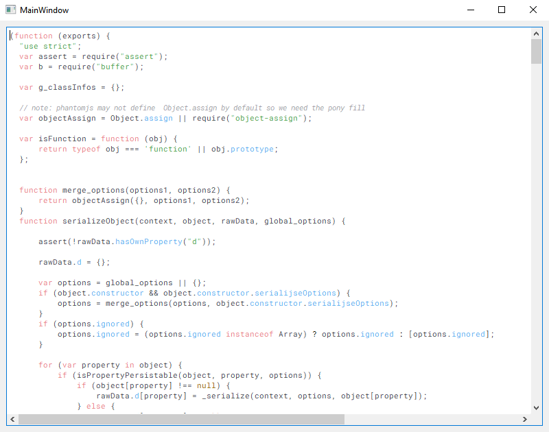

# text-editor-treesitter

## Description

The text editor is a user-friendly text editor crafted using the Qt framework. It leverages the powerful parsing capabilities of the [Tree-sitter](https://tree-sitter.github.io/tree-sitter/) library for efficient language parsing, ensuring robust syntax highlighting and intuitive code navigation.

# Demo

